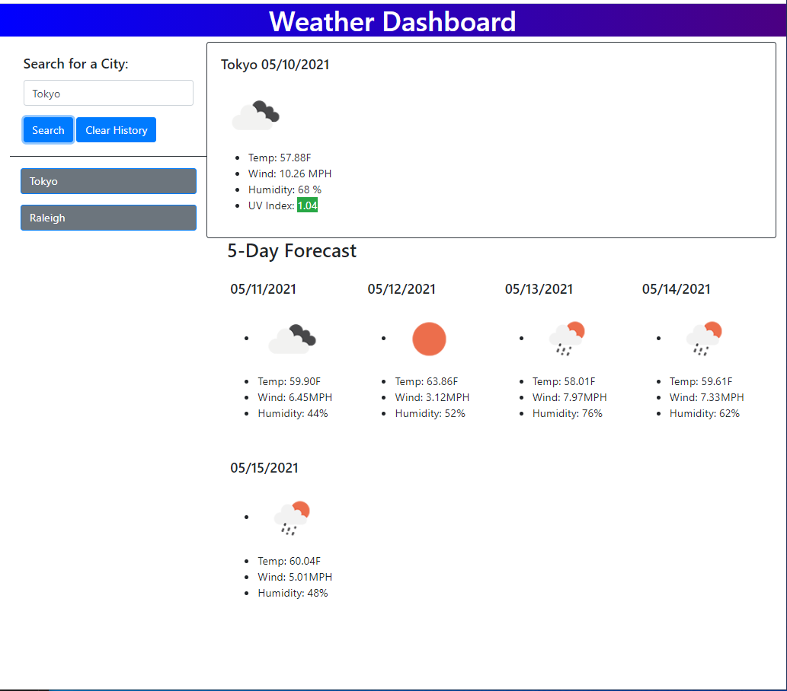

# 6-weather-dashboard
This is the week 6 homework for my coding bootcamp.
1.0 Title:
    Weather Planner

2.0 Introduction:
    The goal of this week's homework was to create a weather dashboard. The user can enter a city and it'll display the current weather as well as a 5 day forecast. It'll also change the background color of the current uv-index based off it's numerical value. The previous search terms will be saved and generate buttons so that they can be revisted quickly.

    However, because of how it is built, it'll only accept the input of a city name. If there is a mispelling, multiple cities with the same name, or the city is not a part of the open weather API city list, it will not work. 

3.0: Technologies:
    It's mainly using Javascript and JQUERY request the data from the Open Weather API. There's also moment for the dates generated. Bootstrap is used to create the elements in the html page.

4.0 Launch:
    The website is located at https://speakeasyman.github.io/6-weather-dashboard/
    The repo is located at https://github.com/speakeasyman/6-weather-dashboard

5.0 My goals:
    My goal was to get it to work. Because I started with the longitude and latitude search query, it is all built around that. A layer above that search, it'll use the user's input and submit a city, then pull out the longitude and latitude and search by that.
    Because I worked from that starting point and moving backwards to where they user would enter their input, it created some complications.

6.0 In use:  

Here it is with a history search of Raleigh, and a current search of Tokyo.  

